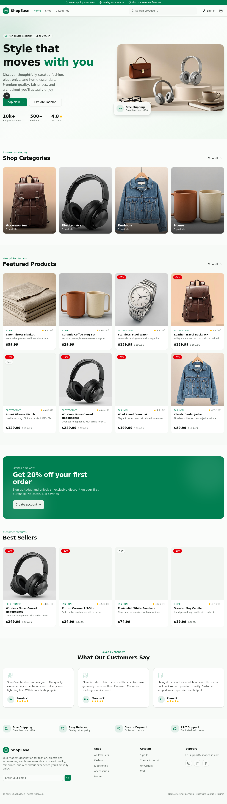

# ShopEase — Modern E-commerce Web Store

A clean, responsive, and professional e-commerce web store built for portfolio showcase. Features full-stack development with product browsing, cart, checkout flow, order tracking, and a complete admin dashboard.



## Tech Stack

| Layer | Technology |
|-------|-----------|
| Framework | **Next.js 16** (App Router, Turbopack) |
| Language | **TypeScript 5** |
| Styling | **Tailwind CSS 4** + **shadcn/ui** (New York) |
| Database | **Prisma ORM** with **SQLite** |
| State | **Zustand** (cart/auth) + **TanStack Query** (server state) |
| Charts | **Recharts** |
| Icons | **Lucide React** |
| Auth | Custom scrypt-based session auth (signed cookies) |

## Features

### Customer Side
- **Homepage** — Hero with CTA, featured products, categories, best sellers, testimonials, newsletter
- **Shop** — Product grid with category filter, price range filter, search, and sort (newest / price / popular / rating)
- **Product Detail** — Image gallery, name, price, stock status, quantity selector, add to cart, related products
- **Cart** — Slide-out drawer + full cart page with quantity update, remove, subtotal, coupon codes (`WELCOME10`, `SAVE20`)
- **Checkout** — Customer details, shipping address, order summary, COD or test card payment, stock reduction on order
- **Auth** — Login / Register with demo accounts
- **My Orders** — Order history with status filter
- **Order Detail** — Tracking timeline, items, shipping info, payment
- **Account** — Profile update with shipping address

### Admin Side
- **Dashboard** — Revenue, orders, products, customers stats + 7-day revenue chart, orders-by-status pie, revenue-by-category bar, top products, recent orders
- **Product Management** — Full CRUD with image URLs, price, stock, category, featured/best-seller flags, badges
- **Category Management** — Full CRUD with image and description
- **Order Management** — View all orders, update status (Pending → Processing → Shipped → Completed / Cancelled)
- **Customer Management** — View registered users with order history and total spent

## Demo Accounts

| Role | Email | Password |
|------|-------|----------|
| Admin | `admin@shopease.com` | `admin123` |
| Customer | `customer@shopease.com` | `customer123` |

## Getting Started

```bash
# Install dependencies
bun install

# Set up the database
bun run db:push

# Seed demo data (20 products, 4 categories, demo users, 3 orders)
bun run prisma/seed.ts

# Start the dev server
bun run dev
```

Open `http://localhost:3000` in your browser.

## Business Rules Implemented

- ✅ Users can add products to cart without login (cart persists in localStorage)
- ✅ Checkout supports both guest and logged-in users
- ✅ Product stock reduces after successful order (transactional)
- ✅ Admin can update order status
- ✅ Out-of-stock products are not purchasable
- ✅ Cart total updates automatically
- ✅ Free shipping over $100

## Project Structure

```
src/
├── app/                    # Next.js App Router
│   ├── api/               # API routes (auth, products, categories, orders, admin)
│   ├── layout.tsx         # Root layout with providers
│   ├── page.tsx           # Single-page app entry
│   └── globals.css        # Tailwind + theme (emerald palette)
├── components/
│   ├── app-shell.tsx      # View router (SPA navigation)
│   ├── providers.tsx      # Theme + QueryClient + auth init
│   ├── site/              # Header, footer, cart drawer, product card, hooks
│   └── views/             # All page views
│       ├── home.tsx
│       ├── shop.tsx
│       ├── product-detail.tsx
│       ├── cart.tsx
│       ├── checkout.tsx
│       ├── auth.tsx
│       ├── orders.tsx
│       ├── order-detail.tsx
│       ├── account.tsx
│       └── admin/         # Admin dashboard, products, categories, orders, customers
├── lib/                   # db, auth, types, format, api, utils
├── store/                 # Zustand stores (cart, auth)
└── hooks/                 # use-route (SPA router)
prisma/
├── schema.prisma          # User, Category, Product, Order, OrderItem
└── seed.ts                # Demo data seeder
```

## Screenshots

| Page | Screenshot |
|------|-----------|
| Home | `shot-01-home.png` |
| Shop | `shot-02-shop.png` |
| Product Detail | `shot-03-product.png` |
| Cart | `shot-04-cart.png` |
| Login | `shot-05-login.png` |
| Admin Dashboard | `shot-06-admin-dashboard.png` |
| Admin Products | `shot-07-admin-products.png` |
| Admin Orders | `shot-08-admin-orders.png` |
| Admin Customers | `shot-09-admin-customers.png` |
| Admin Categories | `shot-10-admin-categories.png` |

## Demo Data

20 sample products across 4 categories:
- **Fashion** (5) — Denim jacket, overcoat, sneakers, t-shirt, chinos
- **Electronics** (5) — Headphones, smart watch, bluetooth speaker, keyboard, charging pad
- **Accessories** (5) — Leather backpack, sunglasses, watch, wallet, silk scarf
- **Home** (5) — Coffee mugs, candle, throw blanket, desk lamp, plant pots

---

Built as a portfolio piece demonstrating full-stack development, database design, admin panel development, cart/checkout logic, and responsive UI/UX.
